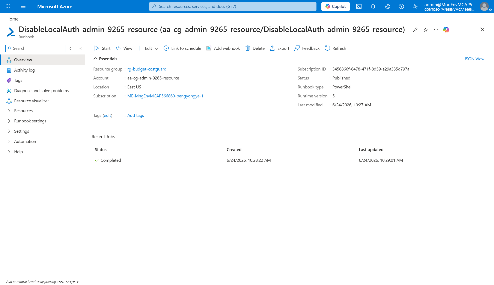
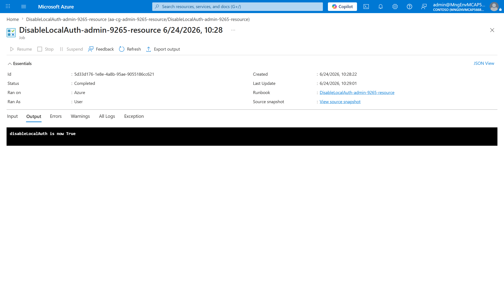
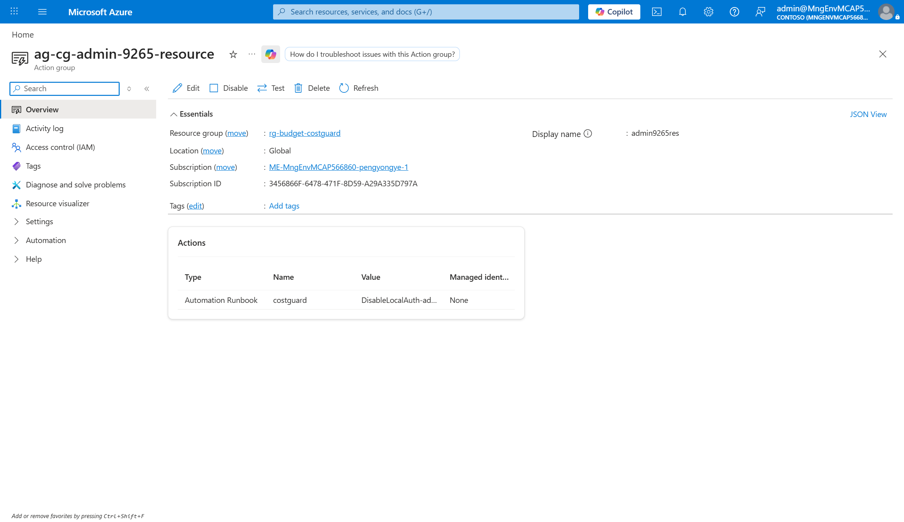
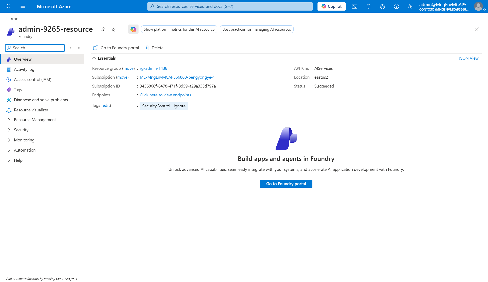

# Azure 预算成本守卫(Cost-Guard)

Windows CMD 脚本,为 Azure **Cognitive / AI Services**
账号配置自动**成本止损开关**。

当账号的月度消费超过预算阈值时,Azure 会自动禁用该资源的**本地(密钥)认证**
(`properties.disableLocalAuth = true`),阻止继续通过密钥调用、防止成本失控。

```
预算告警(达到阈值)
      │
      ▼
Action Group(Automation Runbook 接收器)
      │   └─ 底层通过 runbook 的 webhook URL(serviceUri)触发
      ▼
Automation Runbook  "DisableLocalAuth-<资源名>"
      │   └─ 使用 Automation Account 的系统分配托管身份
      ▼
ARM PATCH  →  properties.disableLocalAuth = true
```

> 说明:Action Group 本身**不能直接执行 CLI 命令**,只能把事件投递给接收器。
> 因此事件被路由到 **Automation Runbook**,由它用托管身份运行 PowerShell 完成禁用。
> Runbook 通过其 **webhook URL** 触发——即使 Action Group 用的是 *Automation
> Runbook* 接收器类型,底层仍是调用该 webhook(`serviceUri`),所以 webhook 是必需
> 组件,而非 runbook 的替代。此外,Azure Automation 沙箱**不含 `az` CLI**,所以
> runbook 直接调用 ARM PATCH,等价于 `az resource update`。

## 前置条件

- 已安装并登录 [Azure CLI](https://learn.microsoft.com/cli/azure/install-azure-cli):
  ```cmd
  az login
  ```
- 具备创建资源和分配角色的权限(目标范围的 Owner / User Access Administrator)。
- 目标 **Cognitive / AI Services** 账号需已存在。

## 用法

```cmd
setup-budget-costguard.cmd <resource> [budget-amount] [threshold-percent]
```

| 参数                  | 必填 | 说明                                          | 默认值 |
|-----------------------|------|-----------------------------------------------|--------|
| `<resource>`          | 是   | Cognitive 账号**名称** 或完整 **resource id** | —      |
| `[budget-amount]`     | 否   | 月度预算金额                                  | `50`   |
| `[threshold-percent]` | 否   | 告警阈值(预算的百分比)                      | `90`   |

### 示例

```cmd
:: 默认(预算 50,90% 告警)
setup-budget-costguard.cmd admin-3283-resource

:: 预算 100
setup-budget-costguard.cmd admin-3283-resource 100

:: 预算 100,80% 告警
setup-budget-costguard.cmd admin-3283-resource 100 80

:: 用完整 resource id
setup-budget-costguard.cmd /subscriptions/<sub>/resourceGroups/<rg>/providers/Microsoft.CognitiveServices/accounts/<name> 100 80
```

资源组会**根据资源自动解析**——你只需传资源本身。

## 配置

编辑 `setup-budget-costguard.cmd` 顶部的变量块:

| 变量                     | 用途                                              |
|--------------------------|---------------------------------------------------|
| `SUBSCRIPTION`           | 目标订阅(留空 = 使用当前 `az` 上下文)            |
| `INFRA_RG`               | 存放 Automation Account 的资源组                  |
| `LOCATION`               | 基础设施资源的区域                                |
| `COG_API_VERSION`        | PATCH Cognitive 账号所用的 API 版本               |
| `BUDGET_AMOUNT` / `BUDGET_THRESHOLD` | 默认值(可被参数 2、3 覆盖)           |
| `ALERT_EMAIL`            | 预算额外通知的邮箱                                |
| `AUTOMATION_PREFIX` / `ACTION_GROUP_PREFIX` / `RUNBOOK_PREFIX` | 命名前缀     |
| `SET_DISABLE_LOCAL_AUTH` | `true` = 禁用密钥(默认);`false` = 启用密钥      |

> ⚠️ **`disableLocalAuth=true` 表示禁用密钥。** 仅当你想要相反行为时,才设为
> `SET_DISABLE_LOCAL_AUTH=false`。

## 创建的资源

以资源名 `admin-3283-resource` 为例,脚本会创建:

| 资源                | 名称                                    | 位置              |
|---------------------|-----------------------------------------|-------------------|
| Automation Account  | `aa-cg-admin-3283-resource`             | `INFRA_RG`        |
| Runbook             | `DisableLocalAuth-admin-3283-resource`  | `INFRA_RG`        |
| Webhook             | `DisableLocalAuth-admin-3283-resource-wh` | `INFRA_RG`      |
| Action Group        | `ag-cg-admin-3283-resource`             | `INFRA_RG`        |
| Budget              | `costguard-admin-3283-resource`         | 目标 RG(范围限定到该资源) |
| 角色分配            | 为 Automation Account 的托管身份授予 *Cognitive Services Contributor* | 目标资源上 |

## 费用说明

这套链路是**事件驱动**的——平时只是几条配置记录,不产生持续费用。整体成本**几乎为 0**。

| 组件 | 计费方式 | 实际花费 |
|------|----------|----------|
| Budget(预算)        | Cost Management 预算功能免费                       | ¥0 |
| Action Group          | 创建/存在不收费;仅按发出的通知计费(Runbook 动作本身不收费) | ¥0 |
| Automation Account    | 账号本身不收费                                     | ¥0 |
| Runbook 作业          | 每月前 **500 分钟免费**,超出约 **$0.002/分钟**     | 每次触发仅几秒,几乎 ¥0 |
| Webhook               | 免费                                               | ¥0 |
| 角色分配 / 托管身份   | 免费                                               | ¥0 |

> 唯一可能计费的是 Automation 作业时长,但每次禁用密钥的运行只需数秒,即使一个月
> 触发上千次也远在 500 分钟免费额度内,实际仍是 0。

需要留意:

- **通知类动作**:若你后续在 Action Group 中加入短信/语音通知,会有少量费用(邮件每月前 1000 封免费)。当前脚本只用 Runbook 动作,不涉及。
- **被保护的资源本身**(Cognitive / AI Services 账号)照常按其自身用量计费——本脚本不增加它的成本,反而是用来帮你**止损**的。
- 价格随区域与时间变动,以你订阅的实际账单为准。

## 幂等性

脚本可安全重复运行:

- **角色分配** —— 先检查,已存在则跳过。
- **Runbook** —— 不存在才创建;内容总是替换并发布。
- **Webhook** —— 删除后重建(webhook URI 一次性、不可更新)。
- **Action Group / Budget / 身份** —— PUT/PATCH 覆盖(天然幂等)。

> 由于 webhook URI 不可更新,**每次运行都会轮换 webhook URL**。脚本会自动把新 URL
> 同步进 Action Group,所以告警链路始终有效——但你之前手动保存的测试 URL 会失效。

## 测试成本守卫

成本数据有正常的 Azure 延迟(数小时),因此真实预算触发不是即时的。要立即验证链路,
可对运行结束时输出的 webhook URL 发起 POST:

```cmd
curl -X POST "<WEBHOOK_URI>"
```

然后验证:

```cmd
:: 在门户查看 runbook 作业历史:
::   Automation Account -> Runbooks -> DisableLocalAuth-<资源名> -> Jobs

:: 或直接检查资源状态:
az cognitiveservices account show -n <resource-name> -g <resource-group-name> --query "properties.disableLocalAuth"
```

成功运行会输出 `disableLocalAuth is now True`。

## 人工启用key
告警导致key不可以用，需要恢复到可用状态可用用下面的命令(enable会激活key为可使用状态，但是不会更新key)
```cmd
az resource update --resource-group <resource-group-name> --name <resource-name> --resource-type Microsoft.CognitiveServices/accounts --set properties.disableLocalAuth=false
```

### 门户验证截图(图解)

如果你对 Azure 门户不熟悉,可对照以下真实截图逐步核对。

**1. Runbook 概览** —— `Automation Account -> Runbooks -> DisableLocalAuth-<资源名>`。
底部「Recent Jobs」出现一条 **Completed** 记录,即表示链路已执行。



**2. 作业输出** —— 点开那条 Completed 作业,切到 **Output** 选项卡,
应看到 `disableLocalAuth is now True`,这是最关键的成功凭证。



**3. Action Group** —— `ag-cg-<资源名>` 的「Actions」里应有一条
**Automation Runbook** 动作,指向上面的 runbook,说明告警会被正确路由。



**4. Cognitive 资源** —— 目标 AI Services 账号概览页,确认这正是被保护的资源。
（密钥是否被禁用可在该资源的 *Keys and Endpoint* 页或用下面的 CLI 命令核对。）



## 在哪里查看 Runbook

```
Azure 门户 -> Automation Accounts -> aa-cg-<资源名>
  -> 进程自动化 -> Runbooks -> DisableLocalAuth-<资源名>
       - Edit / 编辑 : 查看 PowerShell 源码
       - Jobs / 作业 : 执行历史与输出
       - Webhooks   : 绑定的 webhook
```

## 清理

删除脚本为某个资源创建的全部内容:

```cmd
:: 删除预算
az rest --method delete --url "https://management.azure.com/subscriptions/<sub>/resourceGroups/<cog-rg>/providers/Microsoft.Consumption/budgets/costguard-<资源名>?api-version=2023-11-01"

:: 删除 action group
az monitor action-group delete --name ag-cg-<资源名> --resource-group <infra-rg>

:: 删除角色分配(用 Automation Account 托管身份的 principalId)
az role assignment delete --assignee <principalId> --role "Cognitive Services Contributor" --scope <resource-id>

:: 删除 automation account(连带 runbook + webhook)
az automation account delete --name aa-cg-<资源名> --resource-group <infra-rg> --yes
```

## 说明与限制

- 目标资源类型为 **`Microsoft.CognitiveServices/accounts`**。
- 写入 runbook 的 resource id 是**静态**的——每个资源一个 runbook。要保护多个账号,
  请对每个资源分别运行脚本。
- 某些账号可能被 Azure Policy 强制锁定为 `disableLocalAuth=true`,这种情况下没有可
  翻转的状态。

## 许可证

MIT
